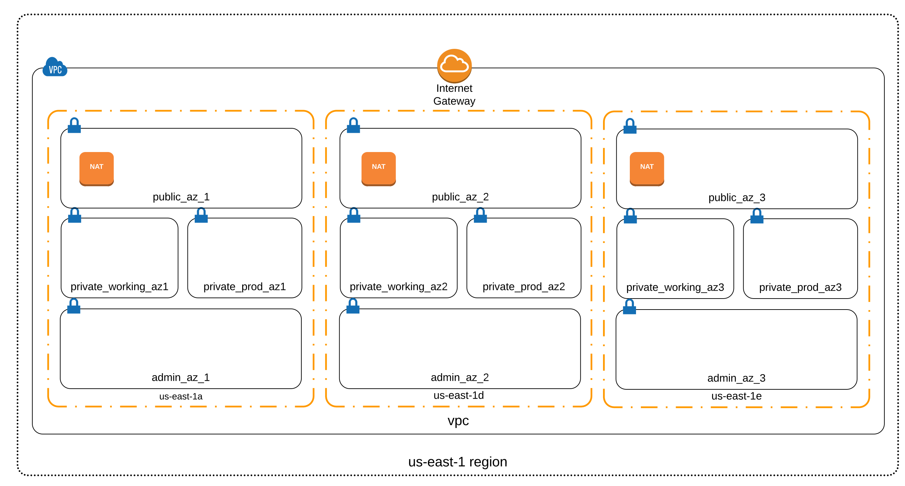

# Amazon Web Services VPC Terraform Module

This Terraform module creates a configurable general purpose [Amazon Web Services VPC](http://docs.aws.amazon.com/AmazonVPC/latest/UserGuide/VPC_Introduction.html). The module offers an opinionated but flexible network topography geared towards general purpose situations with separate public and private subnets. Each VPC can be configured to support one to four availability zones. Private subnet [NAT](http://docs.aws.amazon.com/AmazonVPC/latest/UserGuide/vpc-nat.html) can be configured via [NAT Gateways](http://docs.aws.amazon.com/AmazonVPC/latest/UserGuide/vpc-nat-gateway.html). A single [Internet Gateway](http://docs.aws.amazon.com/AmazonVPC/latest/UserGuide/VPC_Internet_Gateway.html) is created to provide public routing for public subnets. The module does not configure a bastion or VPN instance for private subnet instance access.

This module has been tested with Terraform version 0.11.8

## Example VPC Layout: 3 AZ's



## Usage

* Include the module in your `main.tf`:

```
module "vpc" {
  source = "git::ssh://git@github.com/reactiveops/terraform-vpc.git?ref=2.0.2"

  aws_access_key = "${var.aws_access_key}"
  aws_secret_key = "${var.aws_secret_key}"
  aws_region = "${var.aws_region}"

  az_count =  "${var.az_count}"
  aws_azs = "${var.aws_azs}"

  vpc_cidr_base = "${var.vpc_cidr_base}"

}
```

* Create the required variables either in `main.tf` or a separate `variables.tf` file:

```
variable "aws_access_key" {}
variable "aws_secret_key" {}
variable "aws_region" {}

variable "aws_azs" {}
variable "az_count" {}

variable "vpc_cidr_base" {}

```

* Assign variable values, for example in a `terraform.tfvars` file:

```
aws_azs = "us-west-2a, us-west-2b, us-west-2c, us-west-2d"
az_count = 3
vpc_cidr_base = "10.0"
```

This repo contains a few example `*.tfvars.examples` files showing example variable configurations.

## Configuration Options

### VPC IP Addresses

Generated VPC's will have a /16 CIDR block providing up to 65,536 IP addresses. Choose the IP range you want by setting the `vpc_cidr_base` variable to the first two numbers of the desired IP range. All subnets will use IP CIDR's built on this pattern.

```
vpc_cidr_base = "10.1"
```

The following subnets will be created in each AZ:

* Public
  * Resources requiring public IP addresses such as VPN/bastion instances and Elastic Load Balancers.
* Private working
  * Internal non-production resources such as web servers and database instances.
* Private production
  * Internal production resources such as web servers and database instances.
* Private admin
  * Internal shared administrative resources such as build server instances.

Each subnet will be a /21 block providing up to 2,048 IP addresses per subnet and AZ.

### AZ Count

Your VPC can span between one and four AZ's. You can select the specific AZ's that should be used.

```
aws_azs = "us-west-2a, us-west-2b, us-west-2c, us-west-2d"
az_count = 4
```

### NAT Gateways

`multi_az_nat_gateway`

Ideally, in a multi-AZ setup, there is at least one NAT Gateway residing in each availability zone.  This allows the outbound traffic from private subnets in each AZ to function independently, and allow for some resilience in-case of an AZ outage.

`single_nat_gateway`

In some cases, it may be necessary to use a single NAT Gateway, in a single AZ, to pass all outbound traffic from the VPC.  This is usually a result of more than one private subnet needing to share a single route table. Concessions must be made in this situation since a route table can only contain a single default route.  This configuration introduces a single point of failure (SPOF) in to a multi-AZ environment and should be used only when necessary.

Default values assume a multi-AZ NAT Gateway configuration:
```
variable "multi_az_nat_gateway" {
  description = "place a NAT gateway in each AZ"
  default = 1
}

variable "single_nat_gateway" {
  description = "use a single NAT gateway to serve outbound traffic for all AZs"
  default = 0
}
```

To use a single NAT gateway, set `multi_az_nat_gateway = 0` and `single_nat_gateway = 1` in `terraform.tfvars`

### S3 VPC Gateway Endpoint

[VPC Gateway Endpoints](https://docs.aws.amazon.com/vpc/latest/userguide/vpce-gateway.html) route traffic to S3 or DynamoDB services over private networks avoiding NAT gateways and associated data processing charges on private subnets. Gateway endpoints are similar to NAT and Internet Gateways. There is a gateway endpoint resource and route table entries to direct specific traffic to them.

Setting TF variable `enable_s3_vpc_endpoint` to a truthy value creates an S3 VPC gateway endpoint and adds routes to all private subnet route tables. With this enabled all S3 traffic will route over private networks.

Considerations when enabling:

* There is no additional cost for having this enabled.
* **ENABLING WILL DISRUPT CONNECTIONS** When initially enabling this any inflight S3 connections in the VPC [will be interrupted](https://docs.aws.amazon.com/vpc/latest/userguide/vpc-endpoints-s3.html).
* [DNS resolution must be enabled for the VPC].(https://docs.aws.amazon.com/vpc/latest/userguide/vpce-gateway.html#vpc-endpoints-limitations)

#### Endpoint S3 policy

Each endpoint has an associated IAM style policy attached. This module's default policy allows all access but can be overriden via TF variable `s3_vpc_endpoint_policy`. S3 bucket and IAM policies still apply. The endpoint policy is an additional limitation for connections through the endpoint.

### Tagging

The subnets created can include custom tags by setting variables of the form `SUBNETNAME_subnet_tags`.

| Subnet          | Variable                    |
| --------------- | --------------------------- |
| admin           | admin_subnet_tags           |
| public          | public_subnet_tags          |
| private_prod    | private_prod_subnet_tags    |
| private_working | private_working_subnet_tags |

The routing tables can include custom tags by setting variables of the form `TABLENAME_route_table_tags`.

| Route Table | Variable                 |
| ----------- | ------------------------ |
| public      | public_route_table_tags  |
| private     | private_route_table_tags |

The internet gateway can be tagged with the variable `internet_gateway_tags`

## Testing

This repo contains a few `.tfvars.example` files in the root illustrating different module usage configuration patterns. Each `.tfvars.example` file has a corresponding tfplan output file under `test/fixtures` representing the expected output. The project Makefile includes targets for installing a specific version of Terraform and comparing results of a `terraform plan` against expected output files.

### Setup

Running `make test` requires an actual AWS account for plan generation. The AWS account used requires read-only access to VPC/EC2 resources. No changes are applied. Credentials can be set via environment variables.

```
export TF_VAR_aws_access_key=XXXXXXXXXXXXXXXXX
export TF_VAR_aws_secret_key=XXXXXXXXXXXXXXXXXXXXXXXXXXXX
```

### Executing tests

```
> make test
```

Makefile defaults expect execution on OS X. To execute on Linux:

```
> make test TF_PLATFORM=Linux
```
